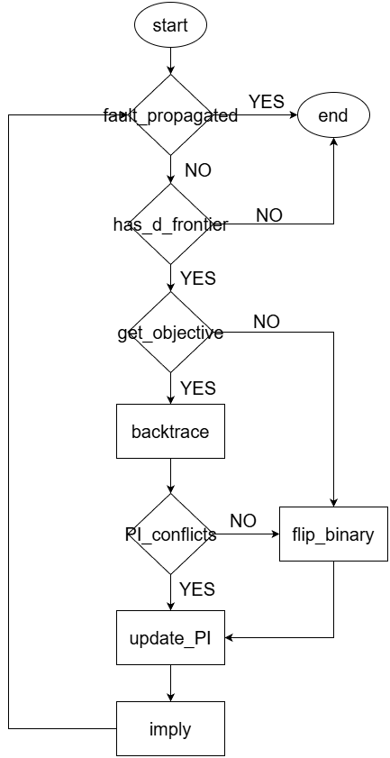

# Podem Test Vector Generation Simulator
The PODEM-based test vector generation engine is implemented as a recursive search algorithm combined with a five-valued logic implication mechanism. The simulator is written in C and operates directly on a structural netlist describing the combinational circuit under test.

## Run & Results
### Run
(1) Clone the repository
```
git clone -b proj3 https://github.com/1102131860/ECE6140.git
```

(2) Build the program
```
cd ./ECE6140/src && make
```

(3) Run the testbench
```
bash run.sh
```
The results store in the fodler `files/`

(4) Execute the program
```
./sim3 -f <file_path> -n <fault_net> -s <sa0/sa1>
```
e.g.
```
./sim3 -f ../files/s27.txt -n 16 -s sa0
```

### Result

**s27 circuit**
|       Fault              |    Test Vector                  |
|--------------------------|---------------------------------|
|  Net 16 s-a-0            |    X0X10X0                      |
|  Net 10 s-a-1            |    X00XXX0                      |
|  Net 12 s-a-0            |    1XXX1XX                      |
|  Net 18 s-a-1            |    11X101X                      |
|  Net 17 s-a-1            |    10X00X0                      |
|  Net 13 s-a-0            |    1XXX1XX                      |
|  Net  6 s-a-1            |    X0X10X0                      |
|  Net 11 s-a-0            |    X10XXXX                      |

**s298f_2 circuit**
|       Fault              |    Test Vector                  |
|--------------------------|---------------------------------|
|  Net 70 s-a-1            |    01X1XXXXXXXXXX0XX            |
|  Net 73 s-a-0            |    111XXXXXXXXXXX0XX            |
|  Net 26 s-a-1            |    XX1X1XXX0XXXXXXXX            |
|  Net 92 s-a-0            |    X10101XXXXXX0X0XX            |
|  Net 38 s-a-0            |    01X0XXXXXXXXXX0XX            |
|  Net 46 s-a-1            |    X1010XXXXXXX0X0XX            |
|  Net  3 s-a-1            |    1101XXXXXXXXXX0XX            |
|  Net 68 s-a-0            |    X1XX1XXXXXXXX00XX            |

**s344f_2 circuit**
|       Fault              |    Test Vector                  |
|--------------------------|---------------------------------|
|  Net 166 s-a-0           |    01X00XXXXX011XX0XXXXXXXX     |
|  Net  71 s-a-1           |    10XXXXXXXXXXXXXXXXXXXXXX     |
|  Net  16 s-a-0           |    10XXXXXXXXXXXXX1XXXXXXXX     |
|  Net  91 s-a-1           |    111XXXXXXXXXXXXXXXXXXXXX     |
|  Net  38 s-a-0           |    X1XXXXXXXXXXX1XXXXXXXXXX     |
|  Net   5 s-a-1           |    XXXX0XXXXXXXXXXXXXXXXXXX     |
|  Net 138 s-a-0           |    01XX00XXXX0X11X0XXXXXXXX     |
|  Net  91 s-a-0           |    10XXXXXXXXXXXXXXXXXXXXXX     |

**s349f_2 circuit**
|       Fault              |    Test Vector                  |
|--------------------------|---------------------------------|
|  Net  25 s-a-1           |    XXXXXXXXXXXXXXX1XXXXXXXX     |
|  Net  51 s-a-0           |    00XXXXXXXXXXXXX0XXXXXXXX     |
|  Net 105 s-a-1           |    01X1000XXX01XX10XXXXXXXX     |
|  Net 105 s-a-0           |    01X1XXXXXX1XXXX0XXXXXXXX     |
|  Net  83 s-a-1           |    01XX000XXX0X0X10XXXXXXXX     |
|  Net  92 s-a-0           |    01X0001XXX0001X0XXXXXXXX     |
|  Net   7 s-a-0           |    XXXXXX1XXXXXXXXXXXXXXXXX     |
|  Net 179 s-a-0           |    101XXXXXXXXXXXX0XXXXXXXX     |

## Simulation Algorithm



