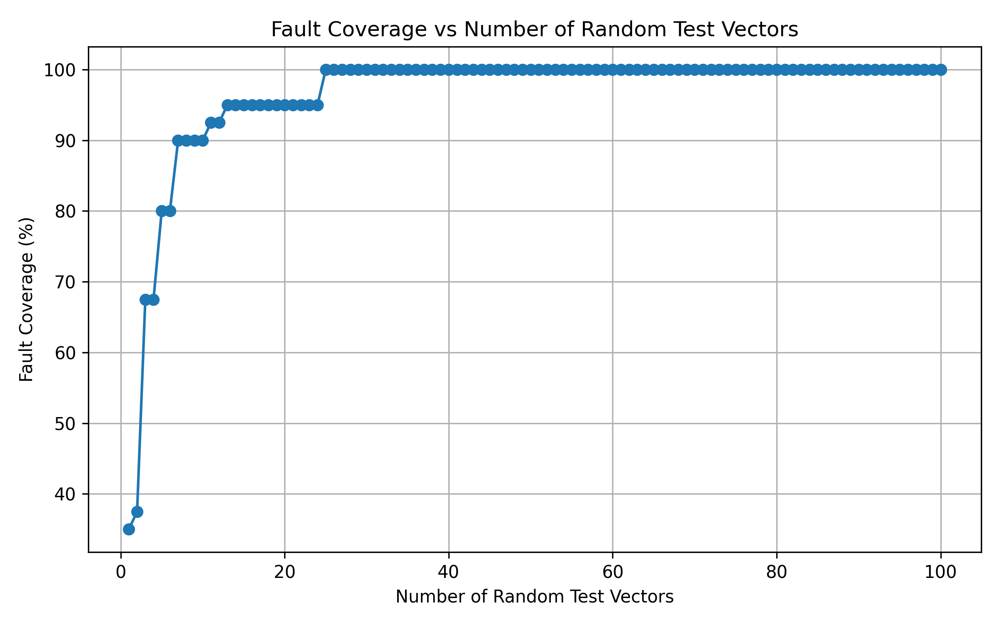
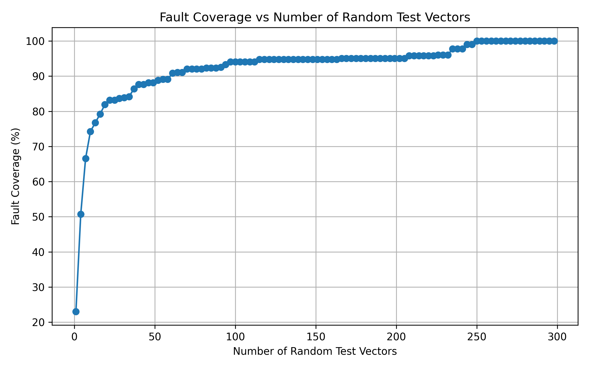
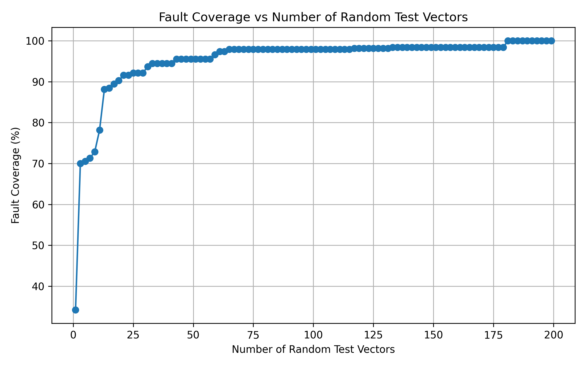
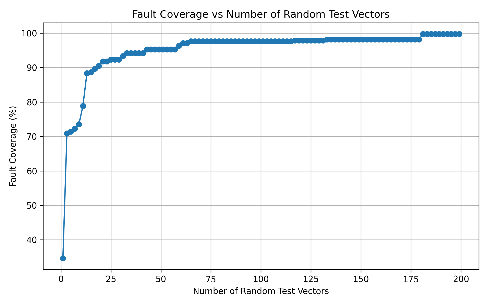

# Dedective fault Simulator
This is a c-based simulator that automatically dedect the stuck faults of the combational logic circuit with a given circuit configuration file and input signals (or randomly generate).

# Run & Results
## Run
(1) Clone the repository
```
git clone -b proj2 https://github.com/1102131860/ECE6140.git
```

(2) Build the program
```
cd ECE6140/src && make
```

(3) Run the all the cases
```
bash run.sh
```

(4) Execute the program
1. Give the input signal
```
./sim2 -f <file_path> -m 0 -i <input_signals>
```
e.g.
```
./sim2 -f ../files/s27.txt -m 0 -i 1110101
```
If some bits are don't care, then you can use `X` to replace.
e.g.
```
./sim2 -f ../files/s27.txt -m 0 -i X0X10X0
```

2. Randomly generate input signals
```
./sim2 -f <file_path> -m 1 -n <testcases>
```
e.g. Randomly generate 10 input vectors
```
./sim2 -f ../files/s27.txt -m 1 -n 10
```

## Result (Coverage vs n testcases)

### S27



### s298f_2



### s344f_2



### s349f_2


