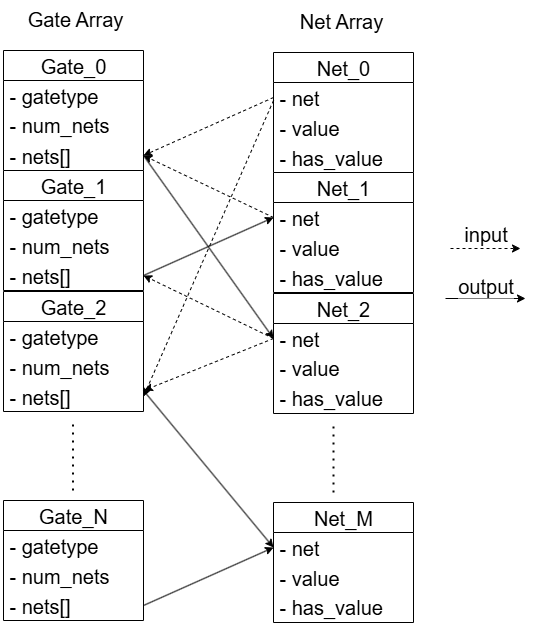
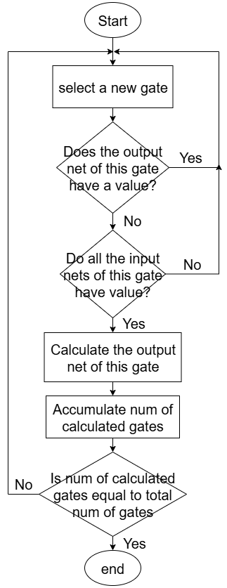

# Combinational Logic Simulator
## Data Structure



## Simulation Algorithm



## Run & Results
### Run
(1) Clone the repository
```
git clone -b proj1 https://github.com/1102131860/ECE6140.git
```

(2) Build the program
```
cd src
make
```

(3) Run the testbench
```
bash test.sh
```

(4) Execute the program
```
./sim1 -f <file_path> -i <input_signals>
```
e.g.
```
./sim1 -f ../files/s27.txt -i 1110101
```

(5) Run multiple cases

Add/modify the run.sh to run your customized input signals
```
bash run.sh
```
### Result
|    circuit         |       Input              |    Output                  |
|--------------------|--------------------------|----------------------------|
|    s27             |      1110101             |    1001                    |
|    s298_2          | 10101010101010101        | 00000010101000111000       |
|    s344f_2         | 101010101010101011111111 | 10101010101010101010101101 |
|    s349f_2         | 101010101010101011111111 | 10101010101010101101010101 |
